# Atividade AWS/LINUX desenvolvida para o estágio de DevSecOps na compasso


- [𝐑𝐞𝐪𝐮𝐢𝐬𝐢𝐭𝐨𝐬 𝐀𝐖𝐒](#requisitos-aws)
  - [Chave de acesso publico](#chave-pública)
  - [vpc, internet gateway e subnet](#vpc)
  - [Instalando NFS e configurando](#instalando-nfs-e-configurando)
-------------------------------------------------

- [𝐑𝐞𝐪𝐮𝐢𝐬𝐢𝐭𝐨𝐬 𝐧𝐨 𝐋𝐢𝐧𝐮𝐱](#requisitos-linux)
  - [Criando diretório no NFS](#criando-diretório-no-nfs)
  - [Instalando e configurando apache](#instalando-e-configurando-apache)
  - [Criando script de monitoramento](#criando-script-de-monitoramento)
  - [Configurar a execução automatizada do script a cada 5 minutos utilizando Cron](#configurar-a-execução-automatizada-do-script-a-cada-5-minutos-utilizando-cron)
  - [Versionamento (git local)](#versionamento-git-local)
  - [Criação de html básico para teste do apache](#criação-de-html-básico-para-teste-do-apache)
  - [Instalação do módulo HTTPS no apache](#instalação-do-módulo-https-no-apache)


    𝐑𝐞𝐪𝐮𝐢𝐬𝐢𝐭𝐨𝐬 𝐀𝐖𝐒:

        • Gerar uma chave pública para acesso ao ambiente;
        • Criar 1 instância EC2 com o sistema operacional Amazon Linux 2 (Família t3.small, 16 GB SSD);
        • Gerar 1 elastic IP e anexar à instância EC2;
        • Liberar as portas de comunicação para acesso público: (22/TCP, 111/TCP e UDP, 2049/TCP/UDP, 80/TCP, 443/TCP).

    𝐑𝐞𝐪𝐮𝐢𝐬𝐢𝐭𝐨𝐬 𝐋𝐢𝐧𝐮𝐱:

        • Configurar o NFS entregue;
        • Criar um diretório dentro do filesystem do NFS com seu nome;
        • Subir um apache no servidor - o apache deve estar online e rodando;
        • Criar um script que valide se o serviço esta online e envie o resultado da validação para o seu diretório no NFS;
        • O script deve conter - Data HORA + nome do serviço + Status + mensagem personalizada de ONLINE ou offline;
        • O script deve gerar 2 arquivos de saída: 1 para o serviço online e 1 para o serviço OFFLINE;
        • Preparar a execução automatizada do script a cada 5 minutos.
        • Fazer o versionamento da atividade;
        • Fazer a documentação explicando o processo de instalação do Linux.


 # Requisitos AWS

## Chave pública;

A chave de acesso SSH pode ser gerada junto da criação da VM EC2 no próximo passo.

> Criar 1 instância EC2 com o sistema
Operacional Amazon Linux 2 (Família t3.small,
16 GB SSD);

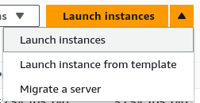


Aqui criamos nossa chave segura para acesso SSH na máquina, esta chave deve ser mantida no PC do usuário, e com ela se tem acesso root total da instância EC2

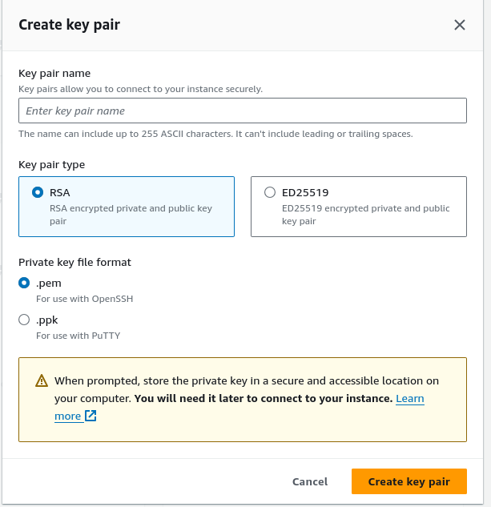

## VPC
Após criar a chave SSH conforme figuras acima, deve-se criar então uma VPC para a máquina, para podermos controlar de forma mais segura o fluxo de rede da mesma.

<!-- 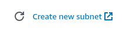 -->

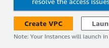

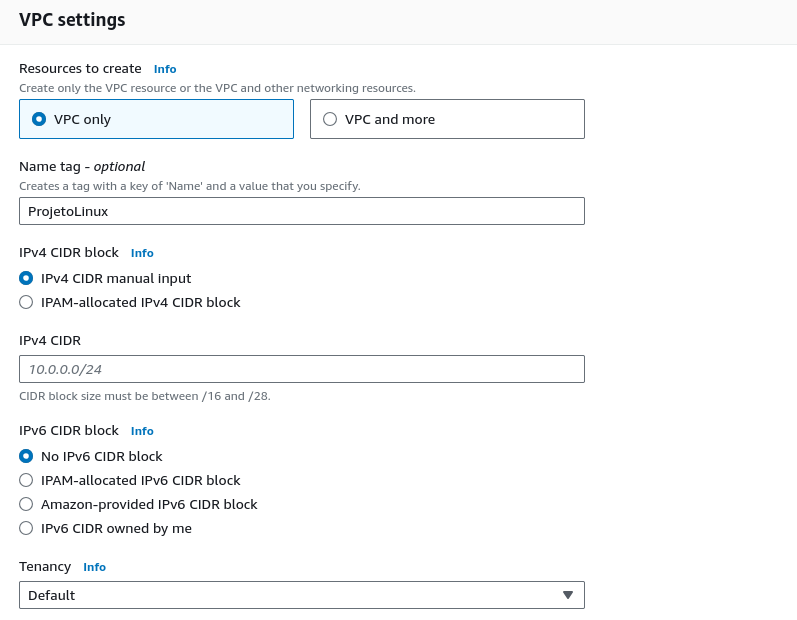


Um passo muito importante é a definição do IPv4 CIDR, que corresponde aos ips internos das máquinas da rede.

Colocando o IP 10.0.0.1/24 conseguimos 256 ips disponíveis no VPC, o que é mais que suficiente na nossa ocasião.

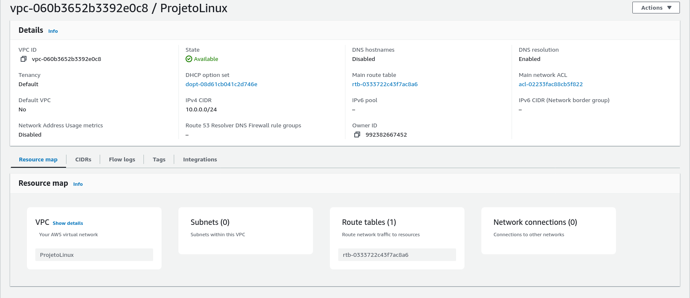


Criamos então a subnet da VPC, com os seguintes parâmetros, a subnet controla as conexões internas e externas das máquinas.

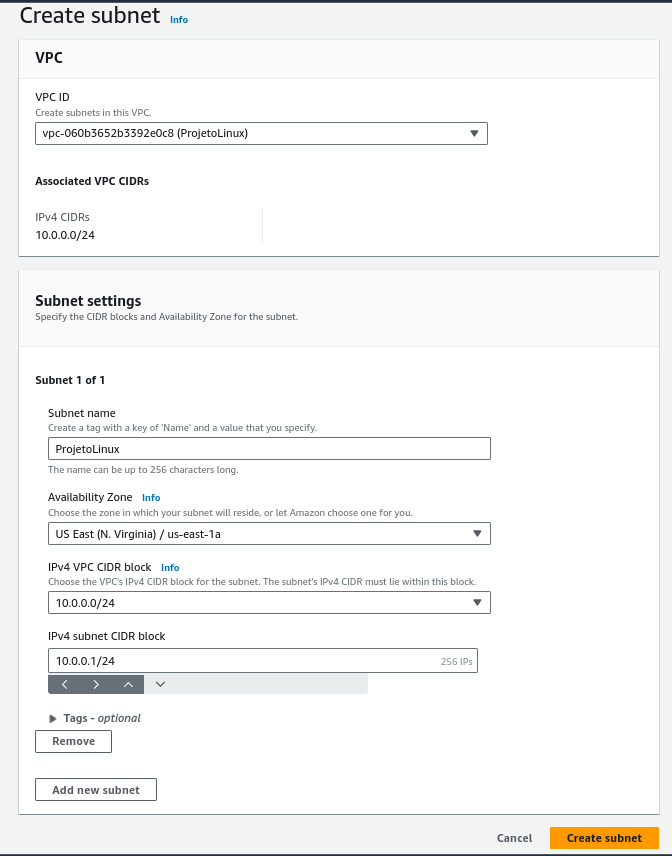


Precisamos então criar uma route table, ela que ira controlar rotas de tráfego na rede.

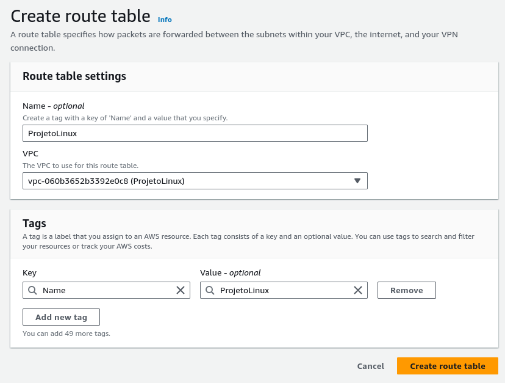

Dentro da instância podemos então linkar a VPC e a Subnet criada anteriormente, assim como ativar o Auto-assign de IP Publico, já que a maquina vai utilizar IP elástico e se conectar com a internet.

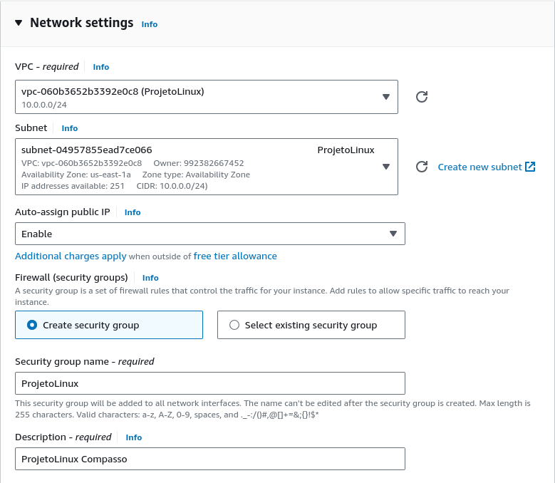

Criamos também um novo grupo de segurança para a máquina, assim podemos customizar exatamente as necessidades dela.

Caso tudo esteja correto, podemos confirmar a criação da instancia!

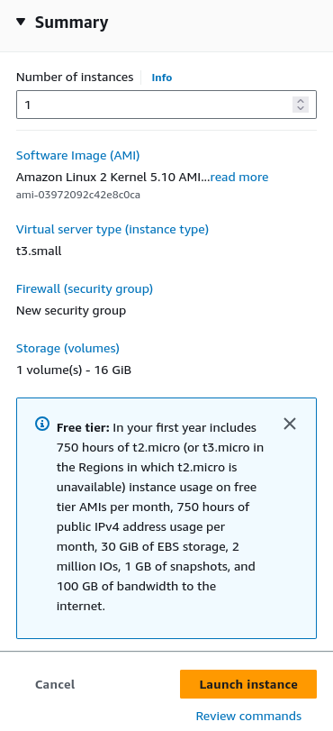
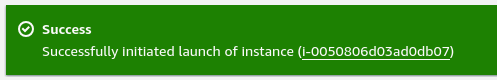


Antes de associarmos nosso IP elástico a instância EC2, precisamos criar um internet gateway, para que a maquina tenha acesso à rede externa

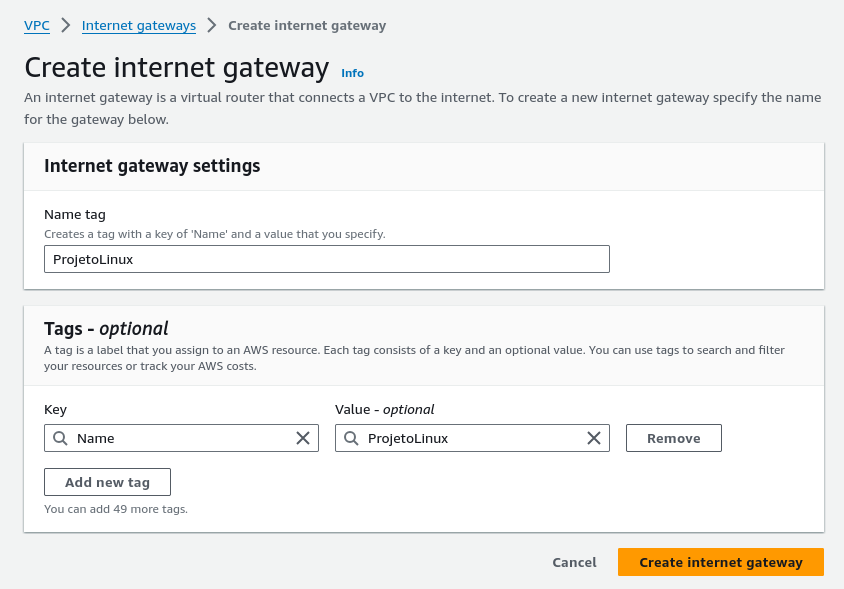

Criamos então um gateway e anexamos ele a VPC que esta sendo usada.

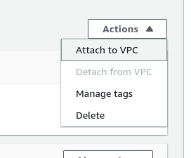

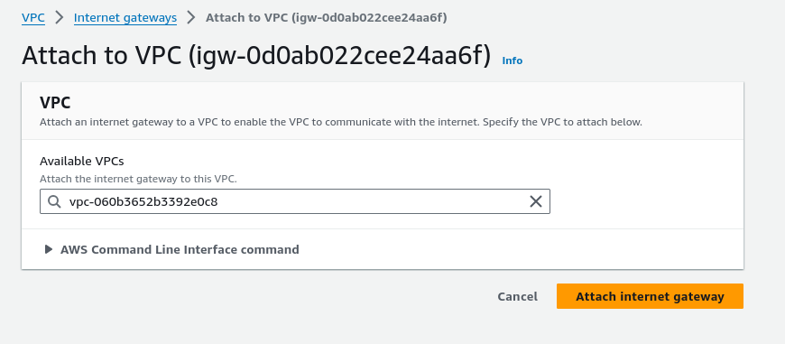

Agora podemos adicionar um IP elástico na máquina.

Na sessão de IP elástico geramos um novo na mesma localidade que a instância EC2 se encontra, e usando as actions associamos ele a instância criada.

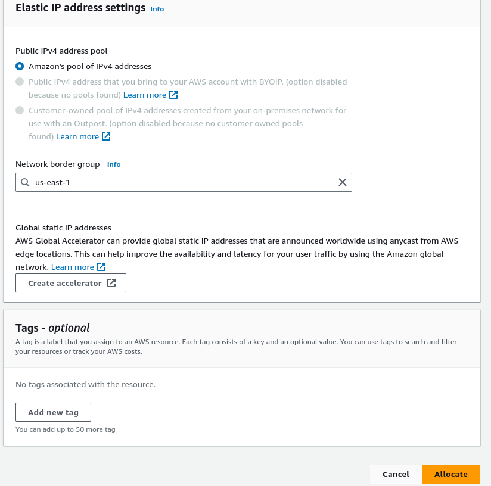

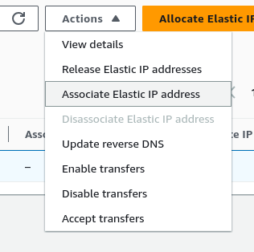

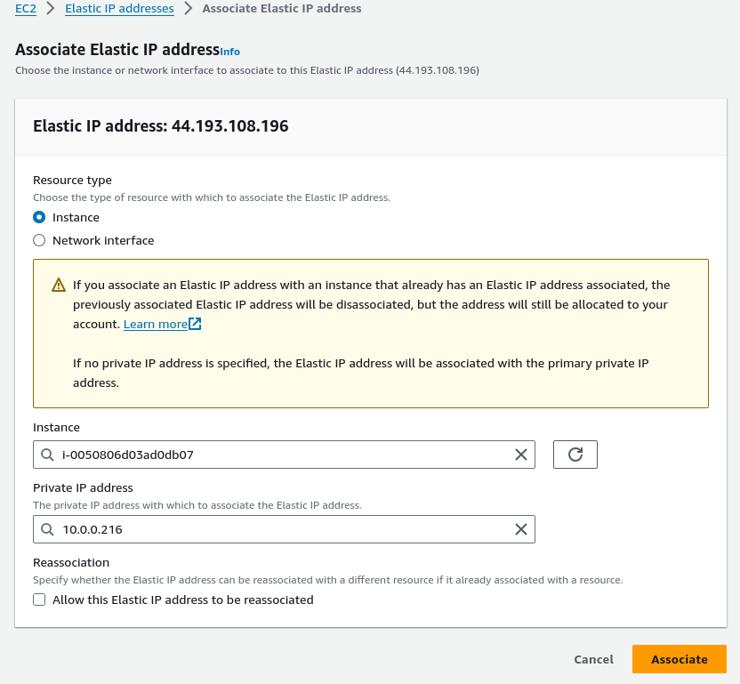

<!--  -->


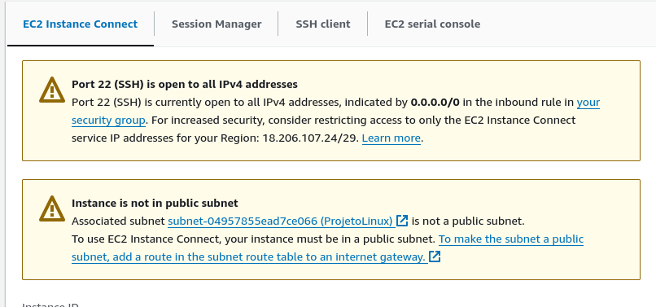

Ainda, sim, neste caso, continua sendo impossível acessar via console virtual e SSH, precisamos configurar o grupo de segurança corretamente agora.

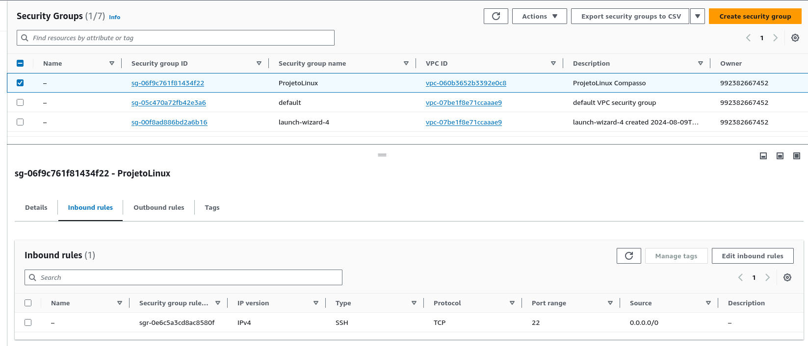


Colocamos o internet gateway para podermos acessar via SSH


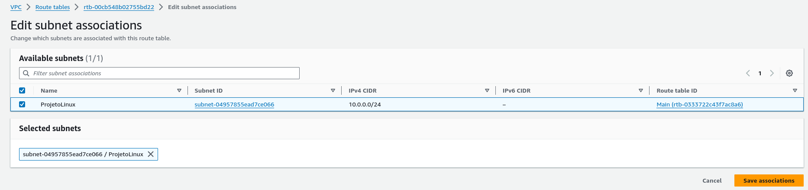

Alteramos também as inbound rules para permitir acesso às portas solicitadas.

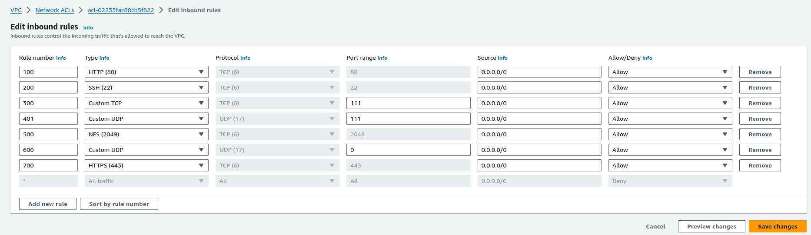


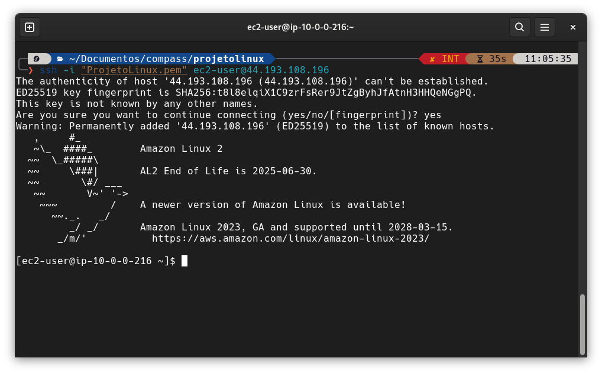


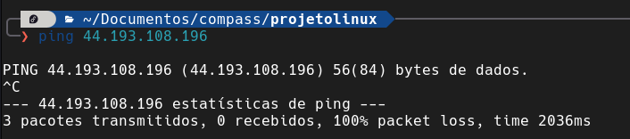


Assim acessando o SSH é possível atualizar o sistema e instalar as aplicações.

# Requisitos Linux
## instalando NFS e configurando
```bash
sudo yum install -y nfs-utils # instala o pacote para gerenciamento de pastas NFS
sudo systemctl start nfs-server
sudo systemctl enable nfs-server
# systemctl configura apps usando o SystemD

sudo mkdir -p /mnt/nfs
sudo vim /etc/exports # arquivo de configuração do NFS

/mnt/nfs *(rw,sync,no_root_squash,no_all_squash)
 # diretorio, * ips que podem se conetar, (leitura e escrita, evita falhas de operação a troco de velocidade, restringe o mapeamento de usuario anonimo)
sudo exportfs -a # exporta a configuração
sudo exportfs -v # verifica se esta funcionando corretamente
```

## Criando diretório no NFS

```bash
sudo mkdir -p /mnt/nfs/juan # no meu caso
```
## Instalando e configurando apache

```bash
sudo yum install -y httpd

sudo systemctl start httpd
sudo systemctl enable httpd

sudo systemctl status httpd # verifica se esta funcionando corretamente
```

## Criando script de monitoramento

```bash
sudo vim /usr/local/bin/check_apache.sh 
```
```bash
[ec2-user@ip-10-0-0-216 bin]$ pwd
/usr/local/bin
[ec2-user@ip-10-0-0-216 bin]$ ls
check_apache.sh
[ec2-user@ip-10-0-0-216 bin]$ cat check_apache.sh 
#!/bin/bash

# Configurações
LOG_DIR="/mnt/nfs/juan"
TIMESTAMP=$(date +"%Y-%m-%d %H:%M:%S")
SERVICE="apache"
STATUS=$(systemctl is-active httpd)

if [ "$STATUS" == "active" ]; then
    echo "$TIMESTAMP - $SERVICE - ONLINE" >> "$LOG_DIR/apache_online.log"
else
    echo "$TIMESTAMP - $SERVICE - OFFLINE" >> "$LOG_DIR/apache_offline.log"
fi
```

```bash
sudo chmod +x /usr/local/bin/check_apache.sh
# liberando permissões de execução para o script
```

Output inicial do script:

`2024-08-15 14:20:02 - apache - ONLINE`

## Configurar a execução automatizada do script a cada 5 minutos utilizando Cron

```bash
sudo crontab -e

# documento aberto no vim:
*/5 * * * * /usr/local/bin/check_apache.sh
# :wq para salvar
```
## Versionamento (git local)

```bash
cd /usr/local/bin
sudo git init
sudo git add check_apache.sh
sudo git commit -m "Adicionado script de monitoramento do Apache"
```

## Criação de html básico para teste do apache

```bash
cd /var/www/htm
sudo vim
```
```html
<!DOCTYPE html>
<html lang="en">
<head>
    <meta charset="UTF-8">
    <meta name="viewport" content="width=device-width, initial-scale=1.0">
    <title>Welcome</title>
    <link rel="stylesheet" href="https://cdn.jsdelivr.net/npm/bulma@0.9.4/css/bulma.min.css">
</head>
<body>
    <section class="hero is-primary is-fullheight">
        <div class="hero-body">
            <div class="container has-text-centered">
                <h1 class="title">
                    Bem-vindo!
                </h1>
                <h2 class="subtitle">
                    Este é o meu teste Apache, o botão abaixo contem os logs do script de verificação de atividade do server.
                </h2>
                <a href="nfs/view_logs.php" class="button is-link is-large">
                    Ver Logs
                </a>
            </div>
        </div>
    </section>
</body>
</html>
```

Criei também um arquivo PHP para fazer o print de logs, o arquivo se encontra dentro da pasta NFS:

```php
<?php
$directory = '/mnt/nfs/juan';
$files = array_diff(scandir($directory), array('..', '.'));

echo "<h1>Conteúdo dos Arquivos em $directory</h1>";

foreach ($files as $file) {
    // Verifica se o arquivo é um dos desejados
    if ($file === 'apache_offline.log' || $file === 'apache_online.log') {
        $filePath = $directory . '/' . $file;

        if (is_file($filePath)) {
            echo "<h2>$file</h2>";
            echo "<pre>";
            echo htmlspecialchars(file_get_contents($filePath), ENT_QUOTES, 'UTF-8');
            echo "</pre>";
        }
    }
}
?>
```
## Instalação do módulo HTTPS no apache

```bash
sudo yum install mod_ssl -y

sudo openssl req -x509 -nodes -days 365 -newkey rsa:2048 -keyout /etc/pki/tls/private/selfsigned.key -out /etc/pki/tls/certs/selfsigned.crt

# openssl: Utiliza a ferramenta OpenSSL para criar e gerenciar chaves e certificados.

# req: Indica que estamos criando uma solicitação de assinatura de certificado (CSR - Certificate Signing Request).
# -x509: Especifica que queremos criar um certificado autoassinado em vez de uma CSR. O formato x509 é um padrão para certificados SSL.
# -nodes: Significa "no DES" e indica que a chave privada não deve ser criptografada com uma senha.
# -days 365: Define a validade do certificado para 365 dias.
# -newkey rsa:2048: Gera uma nova chave RSA com tamanho de 2048 bits.
# -keyout /etc/pki/tls/private/selfsigned.key: Especifica o caminho onde a chave privada gerada será salva.
# -out /etc/pki/tls/certs/selfsigned.crt: Especifica o caminho onde o certificado autoassinado será salvo.

```


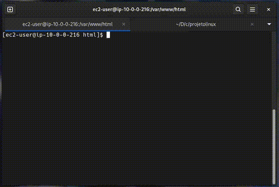


`sudo vim /etc/httpd/conf.d/ssl.conf` 

Altere as seguintes linhas:
```
SSLCertificateFile /etc/pki/tls/certs/selfsigned.crt
SSLCertificateKeyFile /etc/pki/tls/private/selfsigned.key
```

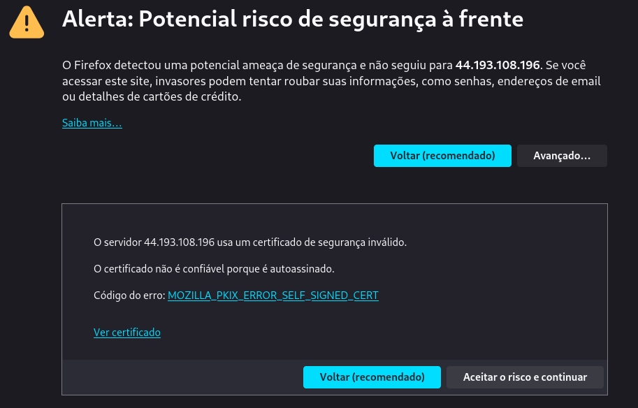

Agora podemos acessar o site(mesmo que de forma não tão segura) utilizando https


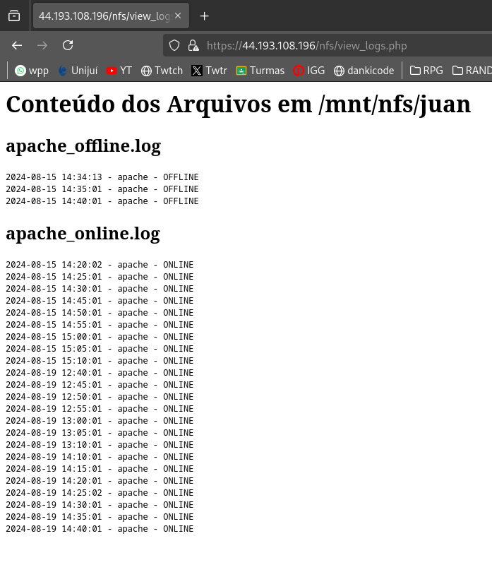
